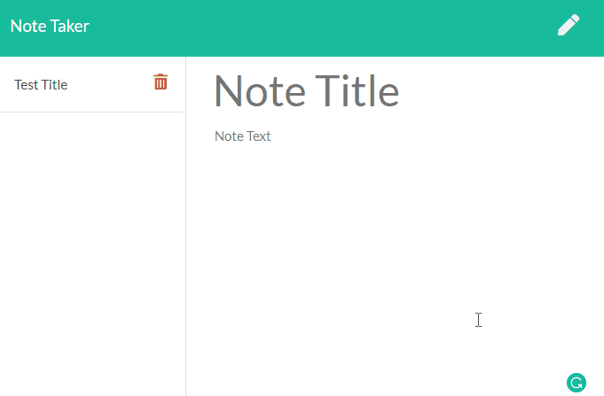

# Note_Taker

## Table of Content

- [Description](#description)
- [User-Story](#user-story)
- [Working-app](#working-app)
- [Installation](#installation)
- [Dependencies](#dependencies)
- [Built-With](#built-with)
- [Questions](#questions)
- [Contributors](#contributors)
- [Author](#author)
- [Images](#images)
- [Demo](#demo)
- [Acknowledgements](#acknowledgements)
- [Copyright](#copyright)

## Description

Creating an application that can be used to write, save, and delete notes  
This application will use an express backend and save and retrieve note data from a JSON file  
The following HTML routes was created:   GET /notes - Returns the notes.html file.   GET * - Returns the index.html file  
The application has db.json file on the backend that will be used to store and retrieve notes using the fs module  
The following API routes were created:  
GET /api/notes - It reads the db.json file and return all saved notes as JSON  
POST /api/notes - It receives a new note to save on the request body, adds it to the db.json file, and then return the new note to the client  
DELETE /api/notes/:id - It receives a query parameter containing the id of a note to delete  
In order to delete a note, the app reads all notes from the db.json file, removes the note with the given id property, and then rewrites the notes to the db.json file  

## User Story

AS A user, I want to be able to write and save notes  
I WANT to be able to delete notes I've written before  
SO THAT I can organize my thoughts and keep track of tasks I need to complete

Business Context:  
For users that need to keep track of a lot of information, it's easy to forget or be unable to recall something important  
Being able to take persistent notes allows users to have written information available when needed  

Acceptance Criteria:  
Application should allow users to create and save notes  
Application should allow users to view previously saved notes  
Application should allow users to delete previously saved notes

## Working app

<https://hidden-lake-44335.herokuapp.com/notes>

### Installation

There is no installation required

### Dependencies

- FS
- Express
- Path

### Built With

- [VScode](https://code.visualstudio.com/) - The editor of choice
- [Notepad++](https://notepad-plus-plus.org/) - My second editor
- [Gitbash](https://gitforwindows.org/) - What would we do without our bash?
- [Heroku](https://heroku.com) - Perfect to upload dev work for testing out

### Questions

1. How can I run the application?  
You just need to click on the link from your favorite browser

2. What if I get an error?  
Ensure that your browser is working properly

3. Is this for writing notes on my broswer?  
Yes, that is correct. At least its light weight and you can access it from anywhere in the world.

### Contributors

I am the sole contributor for this project.

### Licence

This project is licensed under the MIT- License

### Author

John Merchan

### Images

### Demo

### Acknowledgements

My thanks to Aditya and Vishal and special thanks to Agustinn; An amazing team of professional developers, who thrive teaching and sharing their knowledge

#### CopyRight

Copyright 2020 &copy; John Merchan
